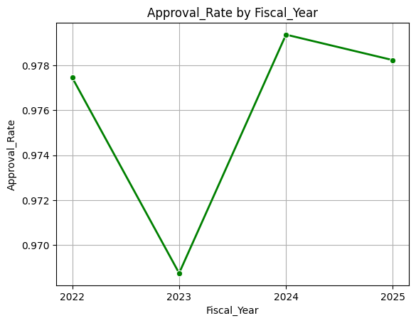

# IDS706_assignment_02
This is a repository for [assignment 2](https://canvas.duke.edu/courses/60978/assignments/282604):

> Choose a beginner-friendly dataset from sources like Kaggle or public APIs. Perform basic data analysis using Pandas and Polars. This includes:
> 1. importing data
> 2. inspecting it
> 3. applying filters and groupings
> 4. exploring a ML algorithm
> 5. visualizing it

### <ins>DATA</ins>

The data I chose is [**H-1B Employer Data Hub**](https://www.uscis.gov/tools/reports-and-studies/h-1b-employer-data-hub?utm_source=chatgpt.com), it comes from the U.S. Citizenship and Immigration Services (USCIS). This database includes:

> data from fiscal year 2009 through fiscal year 2025 (quarter 3) on employers who have submitted petitions to employ H-1B nonimmigrant workers.

> The H-1B Employer Data Hub has data on the first decisions USCIS makes on petitions for initial and continuing employment.

More information about the dataset can be found [here](https://www.uscis.gov/tools/reports-and-studies/h-1b-employer-data-hub/understanding-our-h-1b-employer-data-hub).

 I selected the information from fiscal year 2022 until 2025 (Q3).

### <ins>WHAT DID I DO?</ins>
- I cleaned the column names and imputed missing values depending on the column dtype 
> None of the variables had more than 1% of missing values
- For each variable, I looked at its .describe()
- I dropped certain columns
- I cleaned Industry_NAICS_Code and saved the result in another column
- I calculated how many approvals and denials there were by fiscal years. I considered all the columns that contained `_Approval` and `_Denial`
> The approval rate for each year was over 96%. This number caught my eye but due to time restrictions I didn't look at it further

> This was done using **pandas**
- I looked at the Approval Rate for each fiscal year for North Carolina, California and New York
> The 3 states increased their approval rate in 2024

> This was done using **polars**
- For the **modeling** part I ran a simple Random Forest with ChatGPT's help