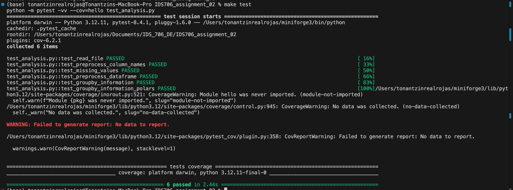

# IDS706_assignment_02
This is a repository for [assignment 2](https://canvas.duke.edu/courses/60978/assignments/282604):

> Choose a beginner-friendly dataset from sources like Kaggle or public APIs. Perform basic data analysis using Pandas and Polars. This includes:
> 1. importing data
> 2. inspecting it
> 3. applying filters and groupings
> 4. exploring a ML algorithm
> 5. visualizing it

### <ins>DATA</ins>

The data I chose is [**H-1B Employer Data Hub**](https://www.uscis.gov/tools/reports-and-studies/h-1b-employer-data-hub?utm_source=chatgpt.com), it comes from the U.S. Citizenship and Immigration Services (USCIS). This database includes:

> data from fiscal year 2009 through fiscal year 2025 (quarter 3) on employers who have submitted petitions to employ H-1B nonimmigrant workers.

> The H-1B Employer Data Hub has data on the first decisions USCIS makes on petitions for initial and continuing employment.

More information about the dataset can be found [here](https://www.uscis.gov/tools/reports-and-studies/h-1b-employer-data-hub/understanding-our-h-1b-employer-data-hub).

 I selected the information from fiscal year 2022 until 2025 (Q3).

### <ins>WHAT DID I DO?</ins>
- I cleaned the column names and imputed missing values depending on the column dtype 
> None of the variables had more than 1% of missing values
- For each variable, I looked at its .describe()
- I dropped certain columns
- I cleaned `Industry_NAICS_Code` and saved the result in another column
- I calculated how many approvals and denials there were by fiscal year. I considered all the columns that contained `_Approval` and `_Denial`
> The approval rate for each year was over 96%. This number caught my eye but due to time restrictions I didn't look at it further

> This was done using **pandas**
- I looked at the Approval Rate for each fiscal year for North Carolina, California and New York
> The 3 states increased their approval rate in 2024

> This was done using **polars**
- For the **modeling** part I ran a simple Random Forest with ChatGPT's help
> The 4 metrics I calculated (accuracy, precision, recall, f1) had a value of 54%-55%

## Assignment 3
The instructions were:
> This assignment is the second part of your two-week project. You will now focus on making your data analysis project reproducible and testable. You’ll write basic unit tests for your data analysis functions and set up a development environment using either Dev Container or Docker. It should be in the same Github Repository you created last week.

1. **Test Coverage:** Includes meaningful unit and system tests that validate core functions such as data loading, filtering, grouping, preprocessing, and machine learning model behavior, with clear structure and edge case handling. Make sure all tests pass.

This was done previously and all the tests passed:

2. **Dev Environment Setup:** A fully functional Dev Container or Docker setup (3 bonus points for both Docker and Dev Container), with requirement file, devcontainer.json/Docker files, ensuring all dependencies correctly installed and clear instructions for building, running, and using the environment.

The steps for de dev environment setup are the following:

### I. Creating a dev container
1. Press `cmd + shift + p` and search for **Add Dev Container Configuration Files**
2. Select **Add configuration to workspace**
3. Select **Python 3** (or the configuration based on your needs)
4. Select the default Python version (just click enter)
5. Select nothing (or, if needed, select additional features to install)
6. Select nothing (or, if needed, include the optional files/directories)
> This created the base **devcontainer** and was added to a `devcontainer` folder

The resulting files from this step are: `devcontainer` folder > `devcontainer.json`

### II. Opening the dev container
1. Select the blue arrows from the left lower bound of VSCode
2. Select **Reopen in Container**
> This will allow us to *reopen* the container, now in Docker (it will look the same)
> Conversely, once we are in Docker we can reopen the container locally by doing `cmd + shift + p` and selecting **Dev Containers: Reopen Folder Locally**
Now on Docker we can see our Container (distracted_chaplygin)

### III. Building an image from Dockerfile
1. Press `cmd + shift + p` and select **Containers: Add Docker Files to Workspace**
2. In the terminal run `docker build -t image-name .` (distracted_chaplygin in our case)
> Builds an image from the Dockerfile and executes all the steps
3. Run `docker run -d -p 8088:3000 --name container-name image-name`
> Runs the container in the back **-d**, maps port **8088** on my host to port **3000** in the container and names the container **container-name**

Now the container was created:
