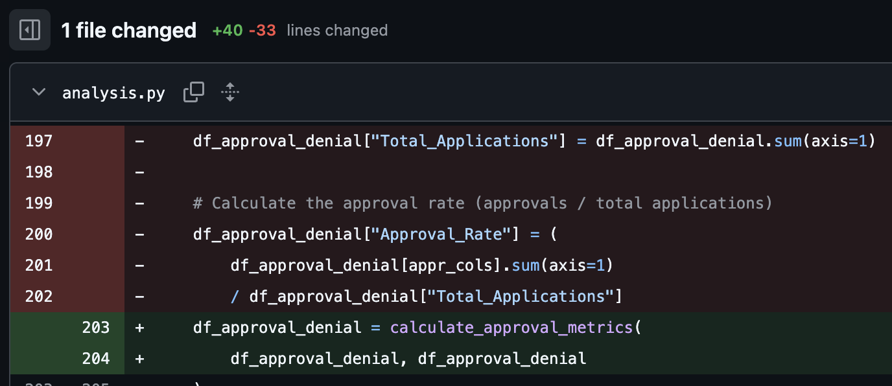

# IDS706 - Data Analysis Project: H-1B Visa Trends Analysis

[](https://github.com/tonantzin-real/IDS706_assignment_02/actions/workflows/main.yml)

## 📊 Project Overview
A data analysis of H-1B visa petition trends from 2022-2025, demonstrating modern data engineering practices including CI/CD, containerization, code quality automation, and machine learning implementation.

## 🎯 Learning Objectives Demonstrated

### ✅ Assignment 2: Data Analysis Fundamentals
- **Pandas & Polars** data manipulation and comparison
- **Data cleaning** and preprocessing pipelines
- **Machine Learning** implementation with Random Forest
- **Data visualization** and trend analysis

### ✅ Assignment 3: Reproducibility & Testing  
- **Unit testing** with comprehensive test coverage
- **Dev Container** setup for consistent development environments
- **Docker** containerization for production deployment
- **Test-driven development** practices

### ✅ Assignment 4: Automation & Code Quality
- **CI/CD pipeline** with GitHub Actions
- **Code refactoring** using VS Code tools (rename, extract method)
- **Code quality** enforcement with Black and Flake8
- **Project automation** via Makefile


## 🏗️ Technical Implementation

### 📁 Project Structure
```python
IDS706_assignment_02/
├── .github/workflows/ # CI/CD configuration
├── .devcontainer/ # Development environment
├── data/ # H-1B visa datasets
├── img/ # Visualizations and screenshots
├── analysis.py # Main analysis pipeline
├── test_analysis.py # Test suite
├── requirements.txt # Dependencies
├── Dockerfile # Production container
└── Makefile # Automation commands
```

### 🛠️ Development Setup
```bash
# Local development
make install    # Install dependencies
make format     # Code formatting
make lint       # Code quality check
make test       # Run tests
make all        # Complete pipeline

# Containerized development
docker build -t h1b-analysis .
docker run -it h1b-analysis
```

### 🔄 CI/CD Pipeline
Automated workflow on every push:
- ✅ Code formatting check (Black)
- ✅ Linting validation (Flake8) 
- ✅ Unit test execution (Pytest)
- ✅ Test coverage reporting


## 📈 Key Findings

### H-1B Visa Approval Trends
- **Overall approval rate**: >96% across all fiscal years
> This number caught my eye but due to time restrictions I didn't look at it further
- **State-level variations**: NC, CA, and NY show increasing approval rates in 2024
- **Industry patterns**: Technology sector (NAICS 51) demonstrates consistent approval trends

### Machine Learning Insights
- **Model performance**: 54-55% accuracy across metrics
- **Feature importance**: Fiscal year, state, and industry code as key predictors
- **Classification challenge**: High class imbalance in approval outcomes

## 🎨 Innovation & Original Contributions

### Domain-Specific Analysis
- **Comparative analysis** of state-level approval trends
- **Industry-focused** examination of technology sector patterns
- **Temporal analysis** of policy impact across fiscal years

### Technical Excellence
- **Dual implementation** of Pandas and Polars for performance comparison
- **Comprehensive testing** strategy covering data validation and ML components
- **Production-ready** containerization with optimized Docker setup


## 📊 Results Visualization


## 📋 Detailed Assignment Documentation

### <ins>DATA</ins>

The data I chose is [**H-1B Employer Data Hub**](https://www.uscis.gov/tools/reports-and-studies/h-1b-employer-data-hub?utm_source=chatgpt.com), it comes from the U.S. Citizenship and Immigration Services (USCIS). This database includes data from fiscal year 2009 through fiscal year 2025 (quarter 3) on employers who have submitted petitions to employ H-1B nonimmigrant workers. It has data on the first decisions USCIS makes on petitions for initial and continuing employment.

More information about the dataset can be found [here](https://www.uscis.gov/tools/reports-and-studies/h-1b-employer-data-hub/understanding-our-h-1b-employer-data-hub).


### <ins>WHAT DID I DO?</ins>
- Cleaned column names and imputed missing values
- Analyzed approval/denial rates by fiscal year and state
- Implemented Random Forest classifier for prediction
- Created comprehensive testing and CI/CD pipeline


### Assignment information

#### Assignment 3
The instructions were:
> This assignment is the second part of your two-week project. You will now focus on making your data analysis project reproducible and testable. You’ll write basic unit tests for your data analysis functions and set up a development environment using either Dev Container or Docker. It should be in the same Github Repository you created last week.

1. **Test Coverage:** Includes meaningful unit and system tests that validate core functions such as data loading, filtering, grouping, preprocessing, and machine learning model behavior, with clear structure and edge case handling. Make sure all tests pass.


This was done previously and all the tests passed:


2. **Dev Environment Setup:** A fully functional Dev Container or Docker setup (3 bonus points for both Docker and Dev Container), with requirement file, devcontainer.json/Docker files, ensuring all dependencies correctly installed and clear instructions for building, running, and using the environment.

The steps for de dev environment setup are the following:


##### I. Creating a dev container
**Purpose:** Set up a consistent development environment using Docker containers
1. Press `Cmd + Shift + P` and search for **Dev Containers: Add Dev Container Configuration Files**
2. Select **Add configuration to workspace**
3. Select **Python 3**
4. Select the default Python version (press enter)
5. Select additional features if needed (or nothing)
6. Select optional files to include (or nothing)

> 📁 This creates a `.devcontainer` folder with `devcontainer.json` - the development environment configuration


##### II. Opening the dev container
**Purpose:** Launch and work within the Docker-based *development* environment
1. Click the blue arrows in the lower-left corner of VS Code
2. Select **Reopen in Container**
> This will allow us to *reopen* the container, now in Docker (it will look the same)
> Conversely, once we are in Docker we can reopen the container locally by doing `Cmd + Shift + P` and selecting **Dev Containers: Reopen Folder Locally**
3. Wait for the container to build and start
> VS Code automatically handles the Docker image building and container creation process in the background
> The first time may take several minutes as it downloads the base image and installs dependencies
Subsequent openings will be much faster due to Docker's layer caching

Now on Docker we can see our Container (e.g., `angry_noyce`)


##### III. Creating a Dockerfile
**Purpose:** Create a production-ready container configuration for deployment
1. Press `Cmd + Shift + P` and select **Containers: Add Docker Files to Workspace**
2. Select **Python: General** in Select Application Platform
3. Select **test_analysis.py** or the main.py for Choose The App's Entry Point
4. Select **No** for Include optional Docker Compose Files
> 🐳 This creates a Dockerfile in your project root - your production container blueprint

##### IV. Building an image from Dockerfile
**Purpose:** Create and *deploy* the application as a standalone Docker container
1. In the terminal run `docker build -t image-name .` (e.g., `ids_assignment_3` in our case)
> *Builds a Docker image from your Dockerfile instructions*
3. Run `docker run -d -p 8088:3000 --name container-name image-name` (e.g., `my_container` in our case)
> *Launch a container from your built image with specific settings*
> 🚀 Flags explanation:
> - **-d:** Run in detached mode (background process)
> - **-p 8088:3000:** Map host port 8088 to container port 3000
> - **--name:** Assign a recognizable name to your container

Now the production container is running:


And we verified successful execution:


#### Assignment 4

The instructions were:
> This is the final part of your two-week data analysis project. Your focus now is to automate the project, clean up the code, and enhance the content with your own innovation. Keep everything in the same GitHub repo you started two/three weeks ago.

##### 1. Add CI (Continuous Integration):
1. Use GitHub Actions (or another CI tool).
2. Add a .yaml file to set up the workflow.
3. Ensure the workflow runs and passes.
4. Add CI status badge in ReadMe file

##### 2. Refactor your code in VS Code, at least try rename and extract method/variable:
1. Press F2, type the new desired name, and press Enter. All instances of the symbol across all files will be renamed.
2. Select the Code Action light bulb or use the Quick Fix command ⌘. and choose extract method/variable

##### 3. Code Quality Tools: use black for formatting and flake8 for linting

##### 4. Commit and Document Changes:

Workflow works: \


Renamed features: \


Extract methods: \
